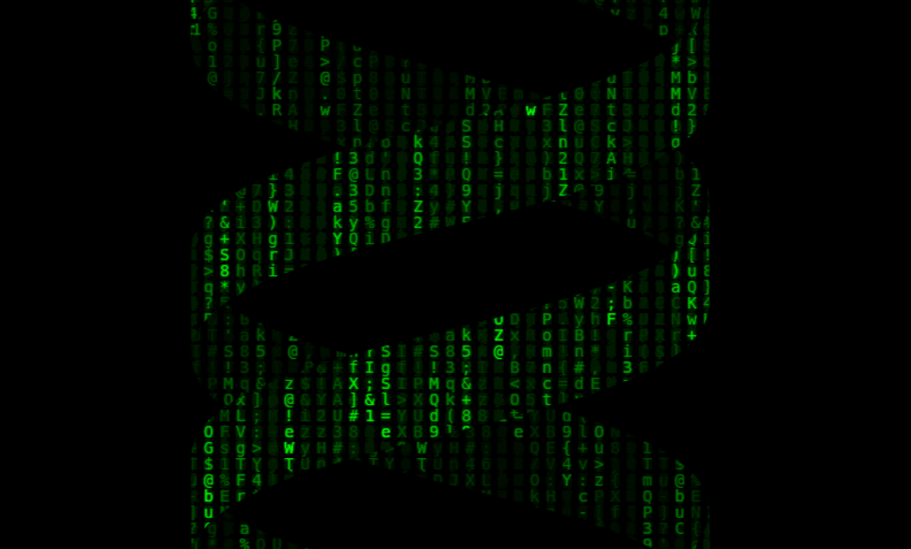

# Shoghi Simon's Silly Shenanigans

This is a collection of fancy effects and animations that I've created using HTML, CSS, SVG, and JavaScript over the years. I noticed that I've been creating a lot of these for projects I've worked on, and I thought it would be fun to compile them all in one place. I hope you enjoy them!



## Getting Started

You can view the animations by visiting my [website](https://shenanigans.shoghisimon.ca/).

### Prerequisites

To build and run the animations locally, you'll need to have [bun](https://bun.sh/) installed.

### Building

If you'd like to run the animations locally, you can clone the repository, install the dependencies, and run the development server.

```bash
git clone https://github.com/SelfMadeSystem/silly-nans.git
cd silly-nans
bun i
bun dev
```

## Built With

- [HTML](https://developer.mozilla.org/en-US/docs/Web/HTML)
- [CSS](https://developer.mozilla.org/en-US/docs/Web/CSS)
- [SVG](https://developer.mozilla.org/en-US/docs/Web/SVG)
- [Tailwind CSS](https://tailwindcss.com/)
- [TypeScript](https://www.typescriptlang.org/)
- [React](https://reactjs.org/)
- [Astro](https://astro.build/)
- [Bun](https://bun.sh/)
- [Cloudflare Pages](https://pages.cloudflare.com/)

## Contributing

If you'd like to contribute to this project, please open an issue or a pull request. I won't be accepting most contributions, but I'm open to suggestions and improvements.

## Author

- **Shoghi Simon** (aka SelfMadeSystem) - [Website](https://shoghisimon.ca/)

## License

This project is licensed under the GNU General Public License v3.0 - see the [LICENSE](LICENSE) file for details.
